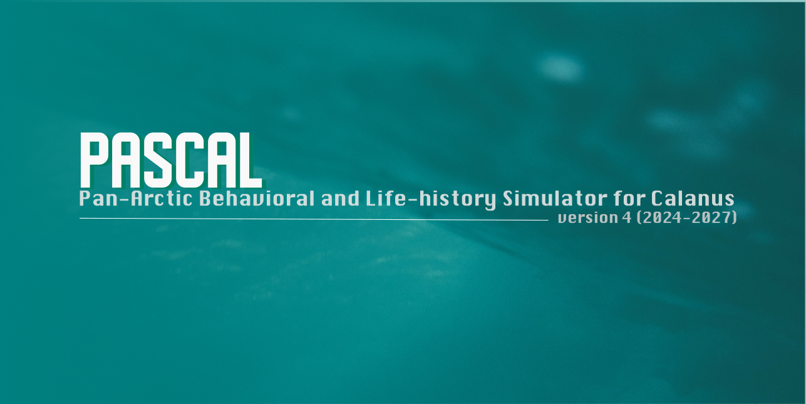
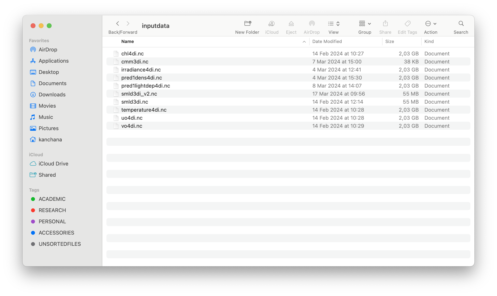
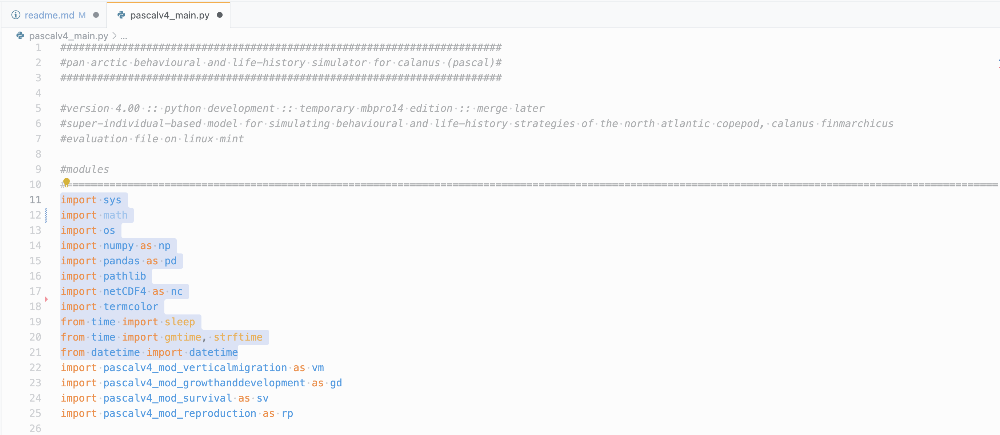

# Pan-Arctic Behavioral and Life-history Simulator for Calanus (PASCAL) v.4.0
## Repository Overview
This is the fourth iteration of PASCAL (Pan-Arctic Behavioral and Life-history Simulator for Calanus) developed under the Norwegian Research Council funded project, Migratory Crossroads (2024-2027). PASCAL v4.0 builds on its previous versions and brings the largest changes since its inception in 2016. These include changes to the core model architecture, modular structure, improved computational efficiency & scalability and support for parallel processing. The main branch of the repository published here on 12.04.2024 is the initial version that has been throughlly debugged and tested for its correct functionality. For the time being, the current repository should only be used among the collaborators for model improvement (e.g., environment update, submodel update, 1D-3D coupling, parallel framework establishment) and is not suitable for actual deployment. The model needs validation with field data, which will be performed when the field data of Migratory Crossroads Work Package-2 (WP2) will be available in Q2, 2025. Until then, the model outputs must be interpreted with extreme caution.

## Who can collaborate?
Inputs from the NFR Migratory Crossroads project members will only be adopted at this stage. As per the project proposal, _Kanchana Bandara_ will be tuning this model further on the fly; _Michael Bedington_ will do the 1D-3D model coupling using OpenDrift; _Phillip Wallhead_ and _Marta Moyano_ will be improving the model environment; _Camila Serra Pompei_ will be contributing to the development of the vertical carbon export submodel; _Varshani Brabaharan_ will be working on the parallelization framework; _Øystein Varpe_ and _Claudia Halsband_ will be critically reviewing the model and suggesting improvements; _Conrad Helgeland_ will be managing the source code and data of/from the model. All other team members are most welcome to work on the model and/or provide suggestions.

## Cloning the repository & downloading input data
For thos who are not familiar with Git, first install Git from [here](https://git-scm.com). If you are using Gitbash or your system´s terminal application (terminal or powershell) , first make a folder (working directory) for the repository to be cloned (e.g., "home/research/pascalv4/"). Then, in the terminal application, set the above working directory as:

```bash
cd /home/research/pascalv4/
```

Then, clone the git repository as:

```bash
git clone https://github.com/Kanchana-Bandara/PASCAL-v4.0.git
```

When the repository is cloned, you may see two empty folders inside the cloned repository; __inpputdata__ and __outputdata__. These are locations to store files - i.e., __inputdata__ for storing model environment files that are read during the model execution and __outputdata__ for storing model outputs. 

__NB:__ The input and output files are not mandatory to be stored in these directories. You can store them wherever desired, but make sure that the correct directory path is added to the model as a reference (see below).

__WARNING:__ When you store input and output data in your local repository, do not stage, commit and push those files to the GitHub repository! Use the __.gitignore__ file and add these folders to exceptions list (e.g., _/inputdata_ and _/outputdata_).

The input data files are not included in this repository due to the large file size (ca. 14.4 GB). The input data files can be downloaded via OneDrive [here](https://akvaplan-my.sharepoint.com/:f:/g/personal/kba_akvaplan_niva_no/Eg2AI-gPBrVMuxT10cSCXj0BEj5boNogP90DExXeQigX6w?e=6zUKTt). Make sure that you unzip the files first before copying/moving them to the __inputdata__ folder of the working directory. Eventually, make sure that the __inputdata__ folder looks something like the following:



## Software requirements
The model is written entirely on Python. Please make sure that you have a working Python instance installed in your machine (> 10.7). The model is relient on several python libraries. In your current base environment or in a new virtual environment linked to the model, use the package manager (pip or Conda) to install the following packages: __numpy, pandas, pathlib, os, sys, math, netCDF4, time, datetime and termcolor__. Some of these libraries are installed automatically with Python installation.



## Setting up input and output paths
The model uses __pathlib__ library to setup input and output data paths. These must be set correctly, otherwise the model will not run. 

__Input data path:__ Find the path to the __inputdata__ folder working directory where the input data files have been deposited (e.g., /home/research/inputdata/). 

__Output data path:__ Similarly find the path to the __outputdata__ folder where model outputs are saved.

Then, replace the paths already specified in the __inputdatapath__ and __outputpath__  in the pascalv4_main.py file with your input and output data paths, respectively (make sure to write the path in double quotes as displayed below).


## Memory and disk space requirements
The model outputs can be heavy (ca. 350 Mb per log file for a ca. 100x100 km grid per calendar year), so, ensure that there is sufficient hard disk space for storing outputs. If you are running on an SSD with limited space, make the __outputdata__ folder outside of the working directory - e.g., in an external hard drive (and add the correct path to the model outputs - more about this below). These files easily scale up when increasing the spatio-temporal coverage. 

For a 100x100 km grid, the model execution requires ca. 7-8 GB of free memory (RAM). 

Thanks to the new model architecture, the memory (RAM) and disk space __does not__ signficantly scale up or down depending on the no. of super individuals in the simulation (but, computational time does).

## Running the model
If all the steps above have been followed correctly, then the model should run without any issue. Some user input is needed at the beginning to verify certain things, such as input file dimensions and run IDs. When the model is running, a progress status will be printed to the screen at regular intervals.

## OS
The model is tested and guranteed to run on Mac and Linux. Although the functionality has not been tested yet, it should run on Windows without an issue also.

## Collaborating to the model development
Those who are tasked with or wish to contribute to the model development __must work on their own branch__ and __must not commit and push changes to the main branch__. None of the changes pushed to the main branch will be adopted! Branches will be merged to the main branch later. Also __do not commit and push input and output data files or files related to your Python virtual environment to the GitHub repository__ add those as an exception to __.gitignore__ file - so they are not staged, committed or pushed.

## Contact
If you have issues with cloning the repository, understanding the code or anything else, please contact _Kanchana Bandara_ via email or MS Teams.

## User manual
This is not a user manual to explain the model. A detailed manual for the code reviewers (__Øystein Varpe__ and __Claudia Halsband__) will be published in this repository soon.