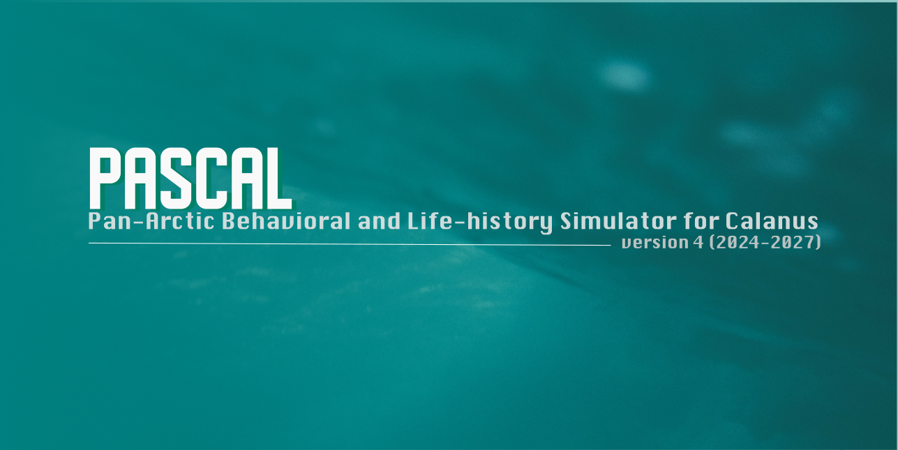

# Pan-Arctic Behavioral and Life-history Simulator for Calanus (PASCAL) v.4.0
## Repository Overview
This is the fourth iteration of PASCAL (Pan-Arctic Behavioral and Life-history Simulator for Calanus) developed under the Norwegian Research Council funded project, Migratory Crossroads (2024-2027). PASCAL v4.0 builds on its previous versions and brings the largest changes since its inception in 2016. These include changes to the core model architecture, modular structure, improved computational efficiency & scalability and support for parallel processing. The main branch of the repository published here on 12.04.2024 is the initial version that has been throughlly debugged and tested for its correct functionality. For the time being, the current repository should only be used among the collaborators for model improvement (e.g., environment update, submodel update, 1D-3D coupling, parallel framework establishment) and is not suitable for actual deployment. The model needs validation with field data, which will be performed when the field data of Migratory Crossroads Work Package-2 (WP2) will be available in Q2, 2025. Until then, the model outputs must be interpreted with extreme caution!

## Who can collaborate?
Inputs from the NFR Migratory Crossroads project members will only be adopted at this stage. 

## Cloning the repository & downloading addtional data